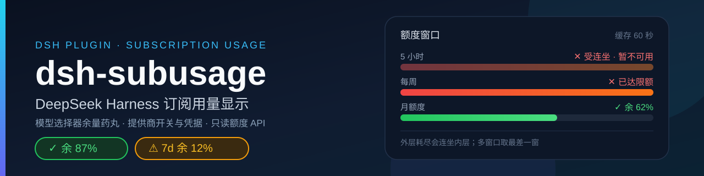

# dsh-subusage



**DeepSeek Harness 订阅用量显示插件。** 在模型选择器旁显示当前模型商的订阅余量药丸，点开可看各周期用量、重置时间与套餐；设置页集中管理 30 条提供商 / 区域路由的检测开关与凭据；并以只读额度 API 供其他插件与 Agent 查询。

> **English.** dsh-subusage shows subscription quota and balance for the AI providers you already use, as a pill next to the model selector in DeepSeek Harness. Provider switches and credentials live in one settings page, and other plugins or agents can read the same snapshot through a read-only quota API.

[](https://www.npmjs.com/package/dsh-subusage)
[](#license--security--许可与安全)
[](#compatibility--兼容性)

## Overview / 功能

| 能力 | 解决什么问题 | 入口 |
|---|---|---|
| 余量药丸 | 不用切到各家控制台，选中模型就知道这家还剩多少 | 模型选择器左侧，槽位 `conversation.input.right` |
| 设置页 | 开关与凭据集中管理；缺凭据、Cookie 过期时把修复入口直接送到卡片上 | 设置 → 订阅用量 → 提供商管理 |
| 只读额度 API | 其他插件与 Agent 复用同一份额度数据，不必各自对接各家接口 | Agent 工具 `subusage_quota`、Host 服务 `subUsage.quota()` |

药丸示例：`✓ 余 87%`、`⚠ 7d 余 12%`、`✕ 7d 已达限额`。多窗口取最差一窗，点击查看完整明细；成功结果按提供商缓存 **60 秒**，手动刷新可跳过普通 TTL（仍遵守上游限流退避与 `Retry-After`）。

本插件**不注册模型路由**，药丸按 provider id 匹配；因此使用哪个插件提供该模型路由不影响匹配，id 对不上时才不显示。

## 支持的数据 / Supported data

共 **30 条 provider id**：新安装**默认开启 10 条、默认关闭 20 条**（数字与清单取自 [`lib/index.js`](lib/index.js) 顶部的 `PROVIDERS`，展示顺序与短名取自 [`lib/client.js`](lib/client.js) 顶部的 `PROVIDER_META` / `PROVIDER_ORDER`）。

| 提供商 | provider id | 额度类型 | 鉴权 | 默认 |
|---|---|---|---|---|
| DeepSeek | `deepseek` | 余额（账户） | Bearer，与推理同一把 Key | 开 |
| Z.ai（中国） | `zai-coding-cn` | 订阅窗口 | Bearer（团队档另加组织 / 项目请求头） | 开 |
| Kimi Coding | `kimi-coding` | 订阅窗口 | Bearer | 开 |
| Xiaomi MiMo | `xiaomi-token-plan-cn` | 周期额度池 | 官方平台 Cookie（含登录流程） | 开 |
| OpenCode Go | `opencode-go` | 订阅窗口 | Bearer | 开 |
| Command Code | `commandcode` | 5 小时 / 周 / 月额度池 | 提供方插件的凭据链 | 开 |
| SuperGrok | `xai-oauth` | 周期池 | 只读 Grok CLI 的 OAuth 登录文件 | 开 |
| Codex (ChatGPT) | `openai-codex` | ChatGPT 订阅窗口 | 只读 Codex CLI 的 OAuth 登录文件 | 开 |
| MiniMax（中国） | `minimax-cn` | 短周期 / 周 | Bearer | 开 |
| ARK Agent Plan (arkcli) | `arkcli-agent-plan` | 订阅窗口（AFP） | IAM AK/SK 签名 | 开 |
| ARK Coding Plan (arkcli) | `arkcli-coding-plan` | 订阅窗口 | IAM AK/SK 签名 | 开 |
| Z.ai（国际） | `zai-coding` | 订阅窗口 | 裸 `authorization`，区域凭据独立 | 关 |
| Synthetic | `synthetic` | 滚动订阅池 | Bearer | 关 |
| NanoGPT | `nanogpt` | 日 / 周配额 + 余额 | Bearer（余额端点用 `x-api-key`） | 关 |
| MiniMax（国际） | `minimax` | 短周期 / 周 | Bearer | 关 |
| ARK Agent Plan Team (arkcli) | `arkcli-agent-plan-team` | 席位额度（AFP） | IAM AK/SK 签名 | 关 |
| ARK Coding Plan Team (arkcli) | `arkcli-coding-plan-team` | 席位额度 | IAM AK/SK 签名 | 关 |
| Ark Coding Plan（中国，旧插件路由） | `ark-coding-plan-cn` | 订阅窗口 | IAM AK/SK 签名 | 关 |
| Ark Agent Plan（中国，旧插件路由） | `ark-agent-plan-cn` | 订阅窗口（AFP） | IAM AK/SK 签名 | 关 |
| Ark Coding Plan（BytePlus，旧插件路由） | `ark-coding-plan-byteplus` | 订阅窗口 | IAM AK/SK 签名 | 关 |
| SiliconFlow | `siliconflow` | 余额 | Bearer，与推理同一把 Key | 关 |
| OpenRouter | `openrouter` | 限额窗口 + 余额 | 推理 Key（余额需 management / provisioning key） | 关 |
| Novita AI | `novita` | 余额 | Bearer | 关 |
| Hyperbolic | `hyperbolic` | 余额 | Bearer | 关 |
| DeepInfra | `deepinfra` | 余额 | Bearer | 关 |
| Chutes | `chutes` | 通用限额窗口 | Bearer | 关 |
| Ollama Cloud | `ollama-cloud` | session / 周 / 月 | 裸 `Authorization`（不加 `Bearer`） | 关 |
| Vercel AI Gateway | `vercel-ai-gateway` | 余额 | Bearer | 关 |
| ZenMux | `zenmux` | 5 小时滚动窗口 + PAYG 余额 | **Management API Key** | 关 |
| LiteLLM | `litellm` | 预算 + 花费 | 虚拟 Key + **用户自填 proxy 地址** | 关 |

- 各家的**窗口语义、明细字段与单位换算**（例如 ZenMux / Ollama 的 0–1 小数、Novita 的 1/10000 USD、Kimi 随套餐变化的窗口集合）见 [提供商清单与额度语义](docs/providers.md)。
- 评估过但**不接入**的厂商与理由见 [提供商覆盖与取舍](docs/provider-coverage.md)（含已由用户决策跳过的 Anthropic）。

非公开控制台接口可能变更；缺失或非法百分比不会被当作零用量；「读取成功」只表示接口读取健康度，不保证仍有额度。

## Compatibility / 兼容性

| 项目 | 值 | 来源 |
|---|---|---|
| 核心 peer 范围 | `@deepseek-ai/dsh` 及各核心包均为 `>=0.2.0-rc.1 <0.3.0-0`（允许该范围内的预发布版本） | [`package.json`](package.json) 的 `peerDependencies` |
| 开发目标版本 | DeepSeek Harness `0.2.0-rc.2` | [开发与验证说明](docs/development.md) |
| 最后验证日期 | `2026-10-09` | 同上 |

声明范围不代表范围内所有版本都已实机验证；实际验证范围（在线接口、真实账号、浏览器像素验收等）见 [开发与验证说明](docs/development.md)。这是树外 Host / Client bundle，通过 `cordis.patch.yml` 插入，不修改 DSH 核心、安装树或 ASAR。

## Install / 安装

| 来源 | 标识 | 说明 |
|---|---|---|
| npm | `dsh-subusage` | 已发布版本见 [npm](https://www.npmjs.com/package/dsh-subusage) |
| GitHub Release tarball | `https://github.com/KouzakiUmi/dsh-subusage/releases/latest/download/dsh-subusage.tgz` | 资产名固定不带版本号 |
| 本地开发目录 | 仓库路径 | 以链接方式使用工作副本 |

```console
# npm 包名
dsh plugin --profile <profile> add dsh-subusage

# GitHub Release tarball（尚未经市场收录时的完整 URL）
dsh plugin --profile <profile> add https://github.com/KouzakiUmi/dsh-subusage/releases/latest/download/dsh-subusage.tgz

# 本地开发目录（link 工作副本）
dsh plugin --profile <profile> add D:\src\dsh-subusage
```

升级与卸载：

```console
dsh plugin --profile <profile> update dsh-subusage
dsh plugin --profile <profile> update dsh-subusage@https://github.com/KouzakiUmi/dsh-subusage/releases/latest/download/dsh-subusage.tgz
dsh plugin --profile <profile> remove dsh-subusage
```

- `<profile>` 换成目标 profile；**Desktop 请使用随包 DSH CLI 或应用内插件管理页**，PATH 上的 npm 全局 `dsh` 不一定是它。参数与 profile 名以目标部署的 `dsh plugin --help` 为准；桌面插件页同样接受包名、GitHub 地址或本地目录。
- 安装只把包放进 profile，**不等于已启用**；按部署方式重载或重启，让 Host 与 Client 一起生效（只刷新页面不保证 Host 升级）。
- 只取压缩包：`npm pack dsh-subusage`；核对发布结果：`npm view dsh-subusage version dist-tags`。

## Quick start / 快速开始

1. 安装并启用 bundle，按部署方式重载或重启。
2. 打开 **设置 → 订阅用量 → 提供商管理**，开启需要的提供商（默认关闭的 19 条需手动开启）。
3. 为它配置凭据：在卡片里展开「连接与凭据」填 Key / AK-SK，或把 Key 放进凭据服务 / 启动环境；MiMo 用「登录并自动导入」。**不知道去哪拿、或填了不生效** → 见[凭据获取指引](docs/credentials.md)。
4. 回到会话，选中该提供商的模型：输入区左侧出现余量药丸（绿色成功 / 红色失败），点开看窗口明细。
5. 排障顺序：点「立即刷新」→ 看设置页顶部 `X/Y 家数据获取成功`（可点击，跳到第一家没读成功的）。

可复现的最小示例（DeepSeek，余额型，默认开启，与推理同一把 Key）：

```powershell
# 任选一种凭据来源
$env:DEEPSEEK_API_KEY = "<你的 DeepSeek API Key>"   # 启动环境；改完需按部署方式重启
# 或在 设置 → 订阅用量 → DeepSeek →「连接与凭据」里手动填写
```

重启后在会话中选中 DeepSeek 模型，药丸显示账户余额；也可以直接让 Agent 调用 `subusage_quota(providers: ["deepseek"])` 验证（无需界面）。

## 前置：这几家需要提供方插件

绝大多数提供商只要一把 API Key 就能用。但下面几家要先装**提供方插件**——它们负责注册模型路由、完成登录并持有凭据；本插件只**读取**同一份凭据，不代为登录、也不保存它们。

| 提供商 | 前置提供方插件 | 凭据从哪来 |
| --- | --- | --- |
| Command Code | [`@mars-sea/dsh-commandcode-provider`](https://www.npmjs.com/package/@mars-sea/dsh-commandcode-provider) | 在该插件的设置页登录，或运行 `cmd login`（兜底读 `~/.commandcode/auth.json`） |
| SuperGrok | [`dsh-grok-kit`](https://github.com/KouzakiUmi/dsh-grok-kit) | 运行 `grok login`，登录文件 `~/.grok/auth.json` |
| Codex（ChatGPT 订阅） | Codex 提供方插件（如 `dsh-codex-connect`） | 运行 `codex login`，登录文件 `$CODEX_HOME/auth.json` 或 `~/.codex/auth.json` |

> **Codex 默认关闭**：它的提供方插件本身就带一个用量药丸，两个并排只是重复信息。想要本插件这一份（比如想把 Codex 和别家放在一起看）可以在**提供商管理**里手动开启。
>
> 这几家的**凭据不在本插件的设置页里**：请用上表的登录方式。缺登录时本插件的卡片会直接给出对应的登录命令。

## Configuration / 配置

- **设置页路径**：设置 → **订阅用量** → 提供商管理。「没有检测到API的默认隐藏」默认开启；首次没有可见条目时管理区自动展开。关闭的提供商仍可配置凭据，只是不会发起用量请求。
- **凭据从哪来**：每一类凭据的**官网入口、环境变量名与界面填入位置**都写在[凭据获取指引](docs/credentials.md)——包括火山的 IAM AK/SK（子用户还要挂 `ArkReadOnlyAccess` 且不限制到项目）、MiMo 的平台会话 Cookie、以及各家 API Key 的对照表。**注意推理 Key 与额度凭据不通用。**
- **默认开关策略**：新安装默认开启 10 条、默认关闭 20 条（**Codex 默认关闭**——它的提供方插件自带用量药丸）；开关即时保存，升级保留已保存的开关，不重算默认值。默认隐藏只影响显示，不会自动开启被关闭的提供商。
- **火山方舟是一组**：7 条路由共用同一组 IAM AK/SK，所以设置页只呈现**一张卡片、一个开关**（组内最后选的那条作为代表），卡片里写明本机实际装了哪几条。这些 provider id 并没有合并——药丸仍按 id 匹配路由。
- **火山方舟不按路由收起**：它的额度走**账号级管控面**，一组 AK/SK 就能查到名下所有套餐（`GetCodingPlanUsage` 与 `GetAFPUsage` 是同一套协议、同一组凭据）。推理路由装没装只影响模型能不能用，**不影响额度能不能查**——所以只持有 Coding Plan、却没在 DSH 里配 coding-plan 路由时，那条额度照样会显示（前提是配了 AK/SK）。
- **凭据来源优先级**（`inherit` 模式）：**凭据服务 → 启动环境 → 旧手动配置兜底**；切到自定义（`manual`）模式时只使用保存的手动 Key。界面会区分这三种来源。
- **不接受本地 Key 的提供商**：`commandcode`（凭据链属提供方插件）、`xai-oauth`、`openai-codex`（只读各自 CLI 的登录文件），以及 MiMo（Cookie 会话）。
- **保存与验证分离**：凭据先确认持久化，再独立做在线验证；检测关闭的提供商只保存凭据、不发起验证，验证失败不代表保存失败。
- **出错时在卡片上修**：MiMo 未登录 / Cookie 被拒 → 「登录并自动导入」；Cookie 临近到期或已过期 → 「重新登录」；其他家缺凭据 → 「配置凭据」（展开该厂商编辑器并滚动过去）。正常状态不显示行动条。

<details>
<summary>凭据与环境：各家默认继承变量与说明（取自 <code>PROVIDERS[id].envName</code>）</summary>

「默认继承变量」指凭据服务 / 启动环境的默认引用名；留空表示不使用继承变量（凭据来自登录文件或官方平台会话）。

| 模型商 | 默认继承变量 | 说明 |
|---|---|---|
| DeepSeek | `DEEPSEEK_API_KEY` | 余额型：`GET /user/balance` 返回账户余额，**与推理是同一把 Key** |
| Z.ai（中国） | `ZAI_CODING_CN_API_KEY` | 团队套餐另填组织、项目 ID（作为 `bigmodel-organization` / `bigmodel-project` 请求头） |
| Z.ai（国际） | `ZAI_CODING_API_KEY` | 独立国际 Coding Plan Key，鉴权用裸 `authorization`，不带 `Bearer` |
| Kimi | `KIMI_CODING_API_KEY` | 需要 Kimi Coding Key，不是 Moonshot 开放平台 Key |
| Xiaomi MiMo | 界面不使用继承 Key | 通过官方平台 Cookie 会话读取（`envName` 只作为服务侧引用名保留） |
| OpenCode Go | `OPENCODE_API_KEY` | OpenCode Go Key |
| MiniMax（国际） | `MINIMAX_API_KEY` | `minimax` 路由；国际站订阅 Key |
| MiniMax（中国） | `MINIMAX_CN_API_KEY` | `minimax-cn` 路由；中国站订阅 Key |
| Command Code | `COMMANDCODE_API_KEY` | 凭据由提供方插件管理，本页只读继承；兜底读取 `~/.commandcode/auth.json`（`cmd login`） |
| SuperGrok | 无 | `xai-oauth` 路由；只读 dsh-grok-kit / Grok CLI 共享的 OAuth 登录文件 `~/.grok/auth.json`（旧版 `~/.dsh/.xai-oauth-auth.json`），不保存、**不刷新 token**；access token 过期时直接说明过期时间并提示去刷（不代刷——refresh-token 轮换由 Grok CLI / grok-kit 各自的锁协议管理，第三端刷新会把它们的轮换顶掉）。API Key（`XAI_API_KEY`）取不到订阅周池 |
| Codex | 无 | `openai-codex` 路由；只读 Codex CLI 的 ChatGPT 订阅登录文件（`$CODEX_HOME/auth.json` 或 `~/.codex/auth.json`，要求 `auth_mode` 为 `chatgpt`），不保存、不刷新 token |
| 火山方舟 Ark（7 条路由） | `VOLC_ACCESSKEY` + `VOLC_SECRETKEY` | 额度查询要 **IAM Access Key 的 AK/SK 配对**，与推理 API Key（`ARKCLI_*_API_KEY` / `ARK_*_API_KEY`）**不是同一套**；7 条路由共用一组 AK/SK。这一组 AK/SK 能**同时**查到 Agent Plan 与 Coding Plan（含团队版席位）——不存在「Coding Plan 专用查询 key」 |
| SiliconFlow | `SILICONFLOW_API_KEY` | 余额型：`GET /v1/user/info` 返回账户余额，**与推理是同一把 Key** |
| OpenRouter | `OPENROUTER_API_KEY` | key 限额与用量用推理 key 即可；**账户余额需要 management / provisioning key**，普通 key 会被 403 拒——此时静默降级为只显示限额，不判失败 |
| Synthetic | `SYNTHETIC_API_KEY` | 模型订阅请求额度 |
| NanoGPT | `NANOGPT_API_KEY` | 也可手动填写 Usage only 管理令牌；配额之外还会读一次账户余额（余额端点用 `x-api-key` 而不是 Bearer；拿不到就静默降级，不影响配额） |
| Novita AI | `NOVITA_API_KEY` | 余额型，与推理同一把 Key；金额单位 **1/10000 USD** |
| Hyperbolic | `HYPERBOLIC_API_KEY` | 余额型；金额单位是**美分** |
| DeepInfra | `DEEPINFRA_API_KEY` | 余额型 |
| Chutes | `CHUTES_API_KEY` | 通用限额窗口 |
| Ollama Cloud | `OLLAMA_API_KEY` | 余额型；鉴权是**裸 `Authorization`**（本插件已按其要求发送） |
| Vercel AI Gateway | `AI_GATEWAY_API_KEY` | 余额型；金额是**十进制字符串** |
| ZenMux | `ZENMUX_MANAGEMENT_API_KEY` | 额度端点**只认 Management API Key**（推理 key 不适用），所以变量名单独区分。在 <https://zenmux.ai/platform/management> 创建该 key |
| LiteLLM | `LITELLM_API_KEY` + 代理地址 | 自建网关：除虚拟 Key（**与推理同一把**）还要在凭据区填写自己的 proxy 地址。管理端点在 **proxy 根**——填了 `/v1` 也会被去掉，不会拼成 `/v1/key/info` |

按 provider id 的字面映射（补齐上表按语义分组、未逐条列出的 7 条火山路由，逐条对应 `PROVIDERS[id].envName`）：

```text
deepseek                 DEEPSEEK_API_KEY
zai-coding-cn            ZAI_CODING_CN_API_KEY
zai-coding               ZAI_CODING_API_KEY
kimi-coding              KIMI_CODING_API_KEY
xiaomi-token-plan-cn     XIAOMI_TOKEN_PLAN_CN_API_KEY   （界面走官方平台 Cookie）
opencode-go              OPENCODE_API_KEY
commandcode              COMMANDCODE_API_KEY
xai-oauth                —                              （OAuth 登录文件）
openai-codex             —                              （OAuth 登录文件）
minimax                  MINIMAX_API_KEY
minimax-cn               MINIMAX_CN_API_KEY
synthetic                SYNTHETIC_API_KEY
nanogpt                  NANOGPT_API_KEY
siliconflow              SILICONFLOW_API_KEY
openrouter               OPENROUTER_API_KEY
novita                   NOVITA_API_KEY
hyperbolic               HYPERBOLIC_API_KEY
deepinfra                DEEPINFRA_API_KEY
chutes                   CHUTES_API_KEY
ollama-cloud             OLLAMA_API_KEY
vercel-ai-gateway        AI_GATEWAY_API_KEY
zenmux                   ZENMUX_MANAGEMENT_API_KEY
litellm                  LITELLM_API_KEY                （另需自填 proxy 地址）
arkcli-agent-plan        ARKCLI_AGENT_PLAN_API_KEY      （额度用 VOLC_ACCESSKEY / VOLC_SECRETKEY）
arkcli-coding-plan       ARKCLI_CODING_PLAN_API_KEY
arkcli-agent-plan-team   ARKCLI_AGENT_PLAN_TEAM_API_KEY
arkcli-coding-plan-team  ARKCLI_CODING_PLAN_TEAM_API_KEY
ark-coding-plan-cn       ARK_CODING_PLAN_CN_API_KEY
ark-agent-plan-cn        ARK_AGENT_PLAN_CN_API_KEY
ark-coding-plan-byteplus ARK_CODING_PLAN_BYTEPLUS_API_KEY
```

解析顺序（`inherit` 模式）：**凭据服务 → 启动环境 → 旧手动配置兜底**；自定义（`manual`）模式只使用保存的手动 Key。Cookie 与登录文件型凭据不走这条链，见 [MiMo 登录与 Cookie](docs/providers.md#mimo-登录与-cookie) 与 [Codex ChatGPT 订阅凭据](docs/providers.md#codex-chatgpt-订阅凭据)。修改启动环境后是否需要重启取决于目标部署，不能把「我已经改了环境变量」当作运行进程已经读到。

</details>

## Permissions & data / 权限与数据

**读取 / 写入的文件**

| 路径 | 用途 | 读写 |
|---|---|---|
| `~/.dsh/dsh-subusage.json` | 本插件自己的配置：开关、手动 Key、MiMo Cookie、Z.ai 组织 / 项目、LiteLLM 地址、火山 AK/SK、计时元数据 | 读写；POSIX 上新建目录 `0700`、临时文件 `0600`，替换前再收紧 |
| `~/.codex/auth.json`（或 `$CODEX_HOME/auth.json`） | Codex CLI 的 ChatGPT 登录（要求 `auth_mode: chatgpt`） | **只读**，不保存、不刷新 |
| `~/.grok/auth.json`（回退 `~/.dsh/.xai-oauth-auth.json`） | Grok CLI / dsh-grok-kit 的 OAuth 登录 | **只读**，不保存、不刷新 |
| `~/.commandcode/auth.json` | Command Code CLI（`cmd login`）的 Key | **只读**兜底 |

**网络访问**：只连上面清单里各家自己的额度 / 余额端点，以及 `platform.xiaomimimo.com`（MiMo 用量与登录）、`api.commandcode.ai`、`cli-chat-proxy.grok.com`、`chatgpt.com/backend-api`、火山管控面 `open.volcengineapi.com` / `ark.ap-southeast-1.byteplusapi.com`，外加你自己填写的 LiteLLM proxy 地址。完整域名表见 [网络端点](docs/providers.md#网络端点)。MiMo 自动登录会另外打开官方平台页面，由你在该页面自行输入密码与验证码。

**密钥如何处理**

- Key 与 Cookie **不回传页面**：读取接口不返回凭据本身，界面不回填已保存的秘密（Cookie 只在需要替换时输入）；公开设置只有 `hasKeys` / `hasCookie` 这类布尔状态与来源标记。
- **日志与产物不落盘**：真实 Key / Cookie 不会写进日志、测试、截图或读取结果；MiMo 响应在返回前做字段级 Cookie 脱敏。
- MiMo 自动登录使用**独立临时 Chrome 会话**：不读取日常 Chrome 配置，不读取密码 / 验证码字段，Cookie 不通过 RPC 返回页面；五分钟未完成自动超时。
- 计时元数据（`xiaomi.loginAt` / `xiaomi.expiresAt`）只是本地时间戳，不是秘密，也不参与凭据有效性判断。
- **这不是加密凭据库**：本版仍兼容本机 JSON 配置存储，凭据以明文落盘；加密凭据存储通道尚未实施。Windows 上的实际访问权限取决于目录 ACL，`chmod` 不能替代 ACL 或加密库。请不要上传、分享该配置文件，也不要把它写进日志或工单。

## 额度查询 API

**Agent 工具 `subusage_quota`**（模型可直接调用，只读：不写设置、不碰凭据）

| 参数 | 类型 | 说明 |
|---|---|---|
| `providers` | `string[]`（可选） | 限定范围。可传本插件的 provider id（`deepseek`、`zai-coding-cn`、`kimi-coding`…），也可直接传厂商名（`zai`、`kimi`、`mimo`、`minimax`、`commandcode`、`grok`、`codex`、`ark`、`deepseek`…）；大小写与 `-` `.` `_` 都无关。省略即读取全部 |
| `refresh` | `boolean`（可选） | `true` 绕过最多 60 秒的缓存，仅在确需最新数字时使用 |

调用约定（**结果永远不为空**）：

- 模型手里的名字往往不是这里的 provider id（它更可能看到 DSH 的路由名，例如 `zai`），所以匹配是**宽松**的：一个名字命中多条路由时**全部返回**（`zai` → 中国版 + 国际版，`ark` → 7 条），每条各自带着真实 `state`（没启用的如实标 `disabled`），由调用方自己判断要看哪条。
- 一个名字都认不出时，返回里会**先**给一条说明（写明可用写法），**再附上全部 30 条数据**——数据先给出去，判断交给调用方，而不是回一个空结果。

**Host 服务**（Cordis `Service`，key 为 `subUsage`）：

```js
const service = ctx.get("subUsage");
const view = await service.quota({ providerIds: ["deepseek"], force: false });
// view = {
//   updatedAt,
//   providers: [{ providerId, label, state, windows, extras, coverage?, freshness?, lastSuccessAt?, error? }]
// }
```

- `state`：`ok` | `no-key` | `no-cookie` | `error` | `disabled`
- `windows[].percent` 是**已用**百分比（0–100）；`extras` 放余额与套餐名等补充项
- 视图**刻意精简**：不返回设置，也不返回 `keySource` / `apiDetected` / 继承变量名等内部状态，第三方消费者拿不到任何与 Key 相关的字段
- 视图里**不出现值为 `undefined` 的字段**：字段缺席表示「这家没有报告」，而不是「报告了空」——带 `undefined` 的键会被调用方的 schema 校验判成型别错误
- 单家读取失败只影响它自己的条目，其余照常返回
- 与设置页共用同一份缓存（TTL 60 秒），频繁调用不会反复请求各家接口

## Troubleshooting / 常见问题

| 现象 | 排查方法 |
|---|---|
| 药丸不显示 | 依次确认：当前模型的 provider id 是否与上表一致（自定义 id 不会自动映射）→ 该家检测开关是否开启 → 是否被「没有检测到API的默认隐藏」收起（可在设置页临时关掉它）→ 运行中的 Host 与 Client 是否都已重载 |
| 设置页没有提供商标签 | 展开提供商管理，确认开关和凭据；无凭据的条目默认隐藏，可临时关闭自动隐藏查看指引 |
| 提示「无凭据 / 未检测到 Key」 | 先确认填的是**额度凭据**而不是推理 Key（两者不通用，见[凭据获取指引](docs/credentials.md)），再按该家小节核对来源、环境变量与权限 |
| 提示「已保存」但仍是「无凭据」 | 凭据编辑要点「**保存设置**」才提交（提供商开关才是立即保存）；确认后若仍为空，把界面文案反馈上来 |
| 某家读取失败，其他家正常 | 单家失败只影响自己的条目。按文案分类处理：认证类（401 / 凭据被拒）换对应产品与区域的凭据；权限 / 未订阅类（403）检查账号权限与套餐；限流类等待退避后重试 |
| 显示认证失效 | 检查是否用了对应产品 / 区域的订阅 Key；MiMo 重新登录或导入 Cookie；旧额度不会当作有效数据保留 |
| MiMo Cookie 过期 | 会话 Cookie 自签发起 24 小时有效。药丸与设置页会在 2 小时内 / 30 分钟内分别变黄、变橙，到期显示「Cookie 已过期，请重新登录」；重新登录或重新导入即重新计时。倒计时只是提醒，真实失效以官方接口返回为准 |
| 药丸显示「未记录登录时间」 | 凭据由旧版本保存，没有计时元数据；重新登录或重新导入一次后开始计时 |
| Kimi 缺少 7 天窗口，或提示结构错误 | 窗口集合按套餐体系下发：老套餐（节奏命名，如 Allegro）为 5 小时 + 7 天，新套餐（Go / Plus 命名）为 5 小时 + 月度总额。0.8.3 起按实际下发的窗口解析，不再要求 7 天窗口；升级后仍报 `Invalid Kimi usage response` 即为未识别的字段结构，插件不会猜测额度，可回报该响应 |
| 显示缓存、部分数据或额度未知 | 查看更新时间和错误说明；缓存来自之前的成功读取，部分数据不保证有可用额度，余额也不等于订阅余量 |
| 刷新后数字暂未变化 | 成功结果按提供商缓存 60 秒；手动刷新可跳过普通 TTL，但仍遵守限流退避和 `Retry-After` |
| MiMo 自动登录无法启动 | Host 所在机器需安装 Google Chrome 并有桌面环境；远程或无桌面部署使用手动导入 |
| 保存成功但验证失败 | 凭据已保存，检查网络、区域或账号后重试；保存与在线验证分别反馈 |
| 保存提示配置已改变 | 另一窗口或实例更新了设置；重新读取配置后再编辑，避免旧表单覆盖新值 |
| 升级后仍是旧界面或 RPC 不匹配 | 确认运行中的 Host 和 Client 都已重载；仅刷新页面不能保证 Host 升级 |
| Command Code 额度与实际账户不同 | 可在药丸弹层切换提供方插件的服务账户；「自动轮换」时仍显示默认账户（顶层 Key）的用量，不跟随轮换中的实际服务账户，提供方自定义 `apiBase` 也不跟随 |
| SuperGrok 提示认证失效 | 登录文件里的 OAuth token 会过期；在 设置 → Grok Kit 重新登录、运行 `grok login`，或让 Grok 侧使用一次以刷新共享登录文件后重试。API Key（`XAI_API_KEY`）取不到订阅周池 |
| 火山方舟报签名或权限错误 | AK 与 SK 必须来自同一个 IAM 用户（跨来源拼凑只会 401 且看不出根因）；确认用的是 IAM Access Key 而不是方舟推理 API Key；403 多为未订阅或权限不足 |

## Development / 开发

| 路径 | 职责 |
|---|---|
| `lib/index.js` | 提供商适配、凭据解析、持久化、缓存、Host RPC 与 `subusage_quota` 工具 |
| `lib/client.js` | Client 模块、共享 store、设置页与模型药丸（含界面中英文文案） |
| `lib/volcengine.js` | 火山方舟 AK/SK 签名与窗口解析（纯函数、零依赖） |
| `lib/mimo-login.js` | 隔离 Chrome 登录、Cookie 提取与任务生命周期 |
| `cordis.patch.yml`、`package.json` | bundle 注册、入口、依赖与打包白名单 |
| `tests/`、`scripts/` | 桩网络 / 隔离文件系统回归；清单、打包、离线预览与浏览器检查 |
| `docs/` | 开发约定、提供商覆盖、UX 设计、发布与更新记录 |

没有源码转译步骤，直接维护 `lib/*.js`。基础检查不需要安装 DSH 或连接账号：

```console
node tests/run-all.mjs
node scripts/check-manifest.mjs
node --check lib/index.js
node --check lib/client.js
node --check lib/mimo-login.js
```

离线预览（生成 HTML，使用虚构用量与桩 Hook，不连接 DSH、不读取真实凭据）：

```powershell
foreach ($theme in @('dark', 'light')) {
  foreach ($width in @(530, 500, 499, 360)) {
    node scripts/render-ui-preview.mjs $width xiaomi-token-plan-cn $theme credentials
  }
}
node scripts/render-ui-preview.mjs 530 nanogpt light pill
node scripts/check-browser-runtime.mjs   # 需要工作区可解析 playwright-core 且本机装有 Google Chrome
```

文档入口：[凭据获取指引](docs/credentials.md)（每类凭据的官网入口、环境变量与填入位置、报错对照）、[开发与验证](docs/development.md)（RPC 契约、缓存与凭据约定、离线预览与实机验收范围）、[提供商清单与额度语义](docs/providers.md)、[提供商覆盖与取舍](docs/provider-coverage.md)、[UX 设计](docs/design-ux.md)、[发布与市场收录](docs/publish.md)、[更新记录](docs/changelog.md)、[审查记录](docs/code-review.md)。

> 打包说明：`package.json` 的 `files` 白名单是 `lib` / `locale` / `cordis.patch.yml` / `README.md`，因此 `assets/title.svg`、`assets/screenshots/` 与 `docs/` **不进 npm 包**——顶部 title 图与下面的界面预览只在 GitHub 页面显示。改动白名单属于发布决策，需单独处理。

### 界面预览

以下为 0.7.0 的离线组件测试截图，使用虚构用量数据，不包含真实账号信息，也不是运行中的 DSH 截图。

深色设置页：查看订阅用量、管理凭据与提供商。


浅色用量弹层：查看每日与每周额度、用量明细。


截图声明见根目录 [`screenshots.json`](screenshots.json)。两张图都是**当前版本**的离线组件预览（虚构用量、桩网络、无凭据），已随本版本重做，底部水印明确标注「非运行中的 DSH 截图」。真实 DSH Loader、实际账号在线接口与多账户映射仍未验收，截图不代表已通过这些检查。

## License & security / 许可与安全

MIT，见 [`package.json`](package.json) 的 `license` 字段。本项目与 DeepSeek Harness 及各服务商**无官方关联**；非公开接口可能随时变更，请以各服务商官方条款为准。

报告安全问题：请**不要**在公开 issue 里粘贴 Key、Cookie 或完整配置文件。优先使用 GitHub 仓库的 **Security → Report a vulnerability** 私有渠道；该入口不可用时，也可以在 issue 中只描述问题与影响范围，凭据一律留空。任何复现步骤请先自行脱敏。
